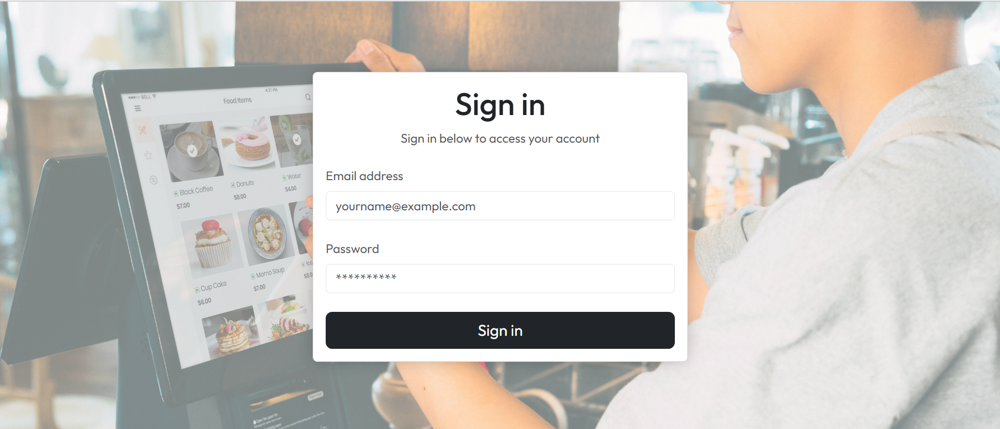
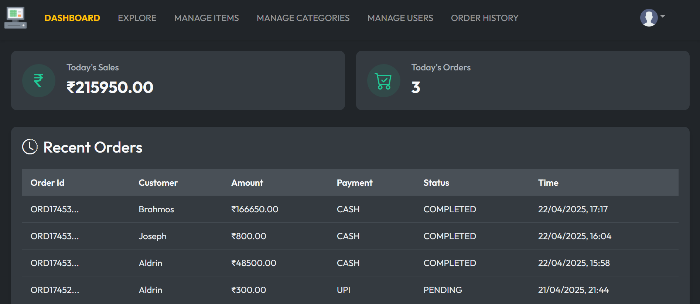
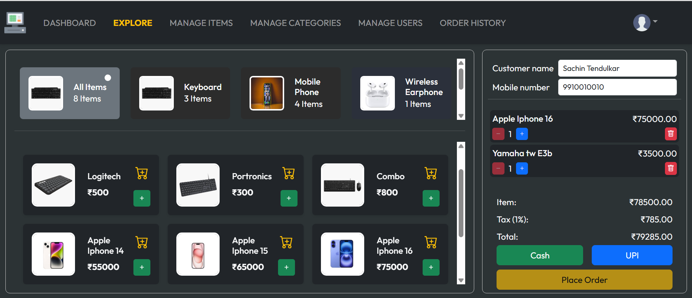
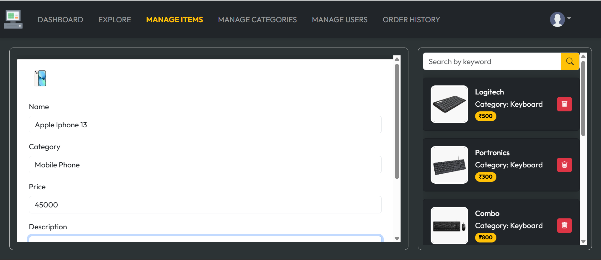
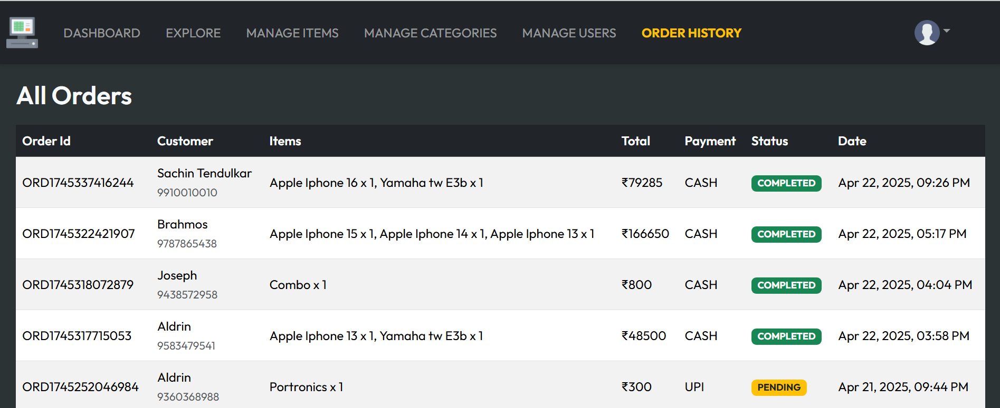
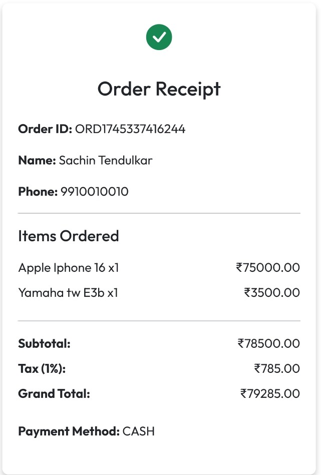
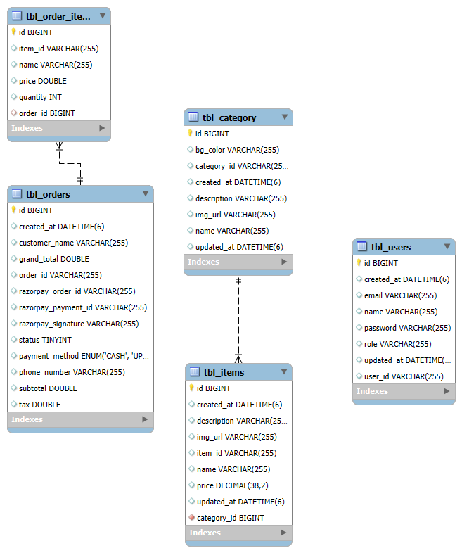

# Retail Billing System 🛒

The **Retail Billing System** is a web-based application that helps retail shops handle orders, generate bills, and process payments seamlessly. It provides dashboards for both owners and workers to operate efficiently.

---

## **Features**

- Role-based Login (Owner / Worker)
- Product and Category Management
- Cart & Order Processing with Tax Calculation
- Payment Integration (Cash / UPI via Razorpay)
- AWS S3 for Image Storage
- Order Receipt Generation

---

## **Tech Stack**

| Technology | Purpose |
|------------|---------|
| **React.js** | Frontend |
| **Spring Boot** | Backend |
| **MySQL** | Database |
| **AWS S3** | Cloud Storage |
| **Razorpay** | Payment Gateway |
| **JWT** | Security (Authentication & Authorization) |

---

## **Frontend Screenshots**

### 🔐 Login Screen  

### 📊 Dashboard  

### 🛒 Explore & Cart  

### 🛠️ Manage Items  

### 📋 Order History  

### 🧾 Order Receipt  

---

## **ER Diagram**

